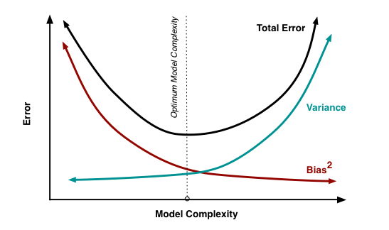

# Interview Questions

## 1. Whats the difference between supervised and unsupervised Machine Learning?

**Supervised** Machine Learning benötigt gelabelte Trainingsdaten.

**Unsupervised** benötigt keine gelabelten Daten.

## 2. What is bias?
Bias ist ein Fehler, welcher Eintritt, wenn der Machine Learning Algorithmus zu stark vereinfacht wurde. Bias kann zu underfitting
führen.

Algorithmen mit niedrigem Bias: k-NN, Decision Trees

Algorithmen mit hohem Bias: Linear Regression

## 3. What is variance?

Variance ist ein Fehler, welcher bei sehr komplexen Machine Learning Modellen auftritt. Das Modell lernt von Ausreissern
im Trainingsset und wird daher viel zu sensitive. Das nennt man
over fitting.

Wenn die Komplexität des Modells erhöht wird, verringert sich der
Bias, doch ab einem gewissen Punkt erhöht sich dann die Variance, 
was wieder zu mehr Fehlern führt.

## 4. Confusion Matrix

Durch die 2x2 Confusion Matrix können viele Kennzahlen zu einem
Modell abgeleitet werden.

**Error Rate** = (FP+FN)/(P+N)

**Accuracy** = (TP+TN)/(P+N)

Error rate + Accuracy = 1.0

